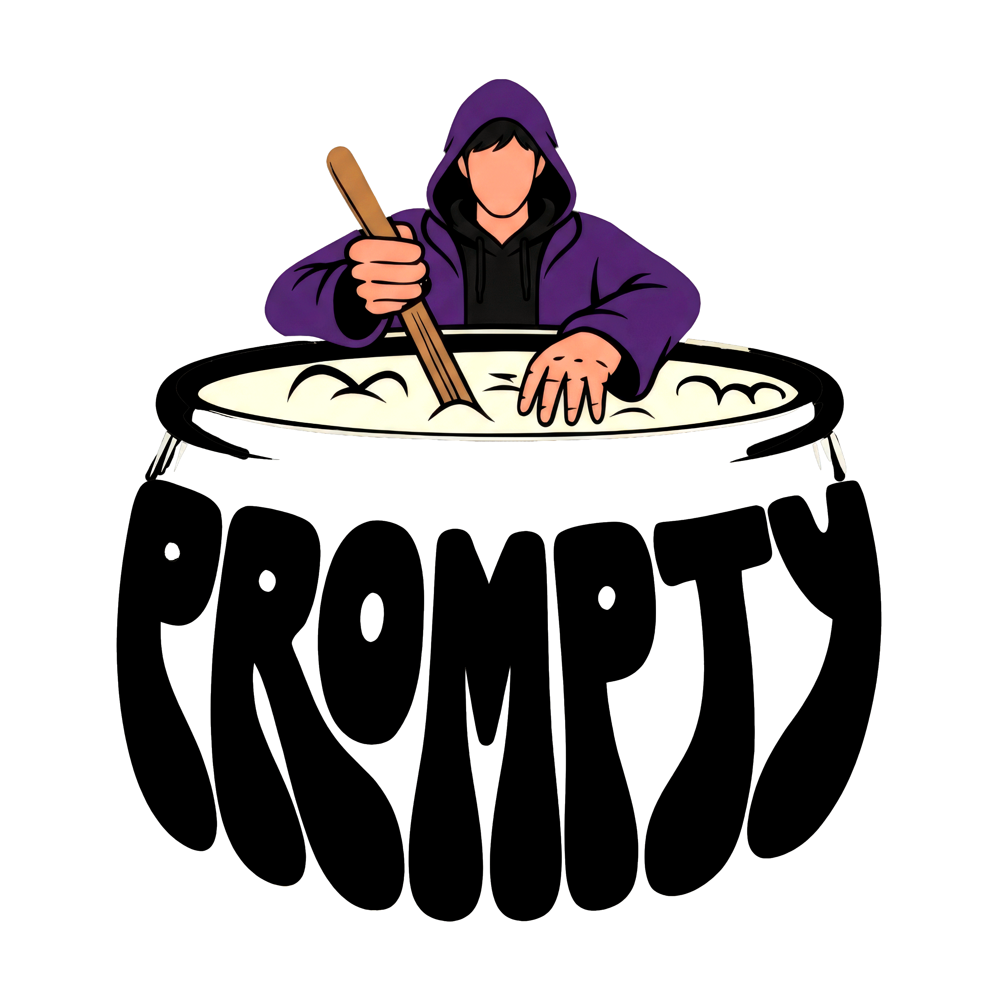

<div align="center">
  
  <br/><br/>

  [](https://nextjs.org)
  [](https://fastapi.tiangolo.com)
  [](https://anthropic.com)
  [](https://dspy.ai)
  [](https://typescriptlang.org)
  [](https://tailwindcss.com)
  [](https://vercel.com)
  [](https://railway.app)

  <h3>AI-powered listing optimization for Mercado Libre sellers.</h3>
  <p>Empirically optimized prompts. Real marketplace data. Measurably better listings.</p>
</div>

---

## ¡Test our website demo!

https://prompty-ashen-alpha.vercel.app/ 

## What is Prompty?

Prompty transforms underperforming Mercado Libre listings into high-converting publications using empirically optimized AI. Sellers describe their product — or paste their current listing — and receive a fully optimized version: title, description, attributes, keywords, and image guidance, all calibrated against the best-selling products in their category.

The platform runs a four-stage pipeline powered by Claude (Anthropic):

- An **Auditor** that diagnoses listing quality against category benchmarks
- A **Researcher** that queries the Mercado Libre API for real-time market data
- A **Text Generator** that produces the optimized listing with DSPy-tuned prompts
- An **Image Generator** that analyzes top-performing product photos via Claude Vision and creates specific prompts for professional-grade imagery

What differentiates Prompty is how the system *learns*. Rather than hand-writing prompts, we use **DSPy (Stanford) with MIPROv2** to optimize them empirically against a custom training dataset of real MELI catalog products. The improvement is measurable: from a baseline mean of **64.95** to an optimized holdout score of **94.32** — a demonstrable, reproducible gain.

Built for the Anthropic × Kaszek Hackathon. The MVP targets the sneakers vertical in Argentina; the pipeline is category and marketplace agnostic.

---

## Architecture

```
User Input (natural language description or raw listing data)
       │
       ▼
┌─────────────┐     ┌──────────────┐     ┌──────────────────┐     ┌─────────────────┐
│   Auditor   │────▶│  Researcher  │────▶│  Text Generator  │────▶│ Image Generator │
│             │     │              │     │                  │     │                 │
│ Diagnoses   │     │ Queries MELI │     │ Produces title,  │     │ Analyzes top    │
│ quality vs  │     │ API: top     │     │ description,     │     │ product photos  │
│ category    │     │ products,    │     │ attributes, and  │     │ via Claude      │
│ benchmarks  │     │ trends,      │     │ keyword strategy │     │ Vision. Creates │
│             │     │ attributes   │     │                  │     │ image prompts   │
└─────────────┘     └──────────────┘     └──────────────────┘     └─────────────────┘
                                                  │
                                   ───────────────────────────────
                                   DSPy MIPROv2 Optimization Layer
                                   Empirically tuned on 70+ real
                                   MELI products across 22 brands.
                                   Not hand-written — measured.
                                   ───────────────────────────────
```

The Next.js frontend proxies requests to a FastAPI backend. The backend orchestrates the pipeline, calling Claude for generation and the MELI API for market data.

---

## Tech Stack

| Layer | Technology | Role |
|---|---|---|
| **Frontend** | Next.js 16 (App Router), TypeScript, Tailwind CSS v4 | Landing page & demo UI |
| **Animations** | GSAP + ScrollTrigger, Lenis, Framer Motion | Scroll-driven & component animations |
| **UI Libraries** | Aceternity UI, ReactBits, shadcn/ui | Pre-built animated components |
| **Backend** | FastAPI (Python) | API server, pipeline orchestration |
| **AI / LLM** | Claude Sonnet 4.6 (generation) · Claude Opus 4.6 (judge) | Text generation, vision analysis, quality scoring |
| **Prompt Optimization** | DSPy (Stanford) + MIPROv2 | Empirical prompt tuning with measurable metrics |
| **Marketplace API** | Mercado Libre API | Real-time product data, trends, required attributes |
| **Training Data** | 70+ products, 22 brands, sneakers vertical | Custom dataset for DSPy optimization |
| **Deployment** | Vercel (frontend) · Railway (backend) | Edge-optimized frontend, Python backend |

---

## The DSPy Advantage

Most AI-powered listing tools ship hand-tuned prompts — someone's best guess at what produces good output. Prompty treats prompts as optimizable programs, not static strings.

**What DSPy is:** A Stanford framework that lets you build LLM pipelines as composable modules with typed signatures. Instead of engineering prompts by hand, you define *what* you want and let an optimizer discover *how* to ask for it.

**What MIPROv2 does:** Multi-Instruction Proposal Optimizer. It generates candidate prompt instructions, evaluates them against your training data using your metric, and selects the combination that maximizes measured quality — iteratively, empirically.

**How we built the training dataset:** We collected 70+ real product listings from the Mercado Libre catalog across 22 brands in the sneakers vertical, plus a secondary **laptops dataset** to validate the pipeline's category-agnostic behavior. For each product, we defined what a high-quality listing looks like: title completeness, keyword coverage, attribute fill rate, and description quality. These become concrete training examples and evaluation targets.

**The result:**

| Split | Score |
|---|---|
| Baseline (val) | 64.95 |
| Optimized (val) | 69.30 |
| Optimized (holdout) | **94.32** |
| Delta | **+29.37 points** |

Optimization ran for **1.2 hours** across the sneakers and laptops datasets, with a training set of 15 examples and 2 bootstrapped demos. The holdout improvement confirms the gains generalize — they're not overfit to the training set.

---

## Mercado Libre API Integration

Working with the MELI API at hackathon pace means navigating real permission constraints.

**Active endpoints:**
- `GET /highlights/MLA/category/{id}` — top-performing products by category (best-sellers proxy)
- `GET /products/{id}` — full product detail including attributes and description
- `GET /trends/MLA/{id}` — trending search keywords in a category
- `GET /categories/{id}/attributes` — required and recommended attributes for a category path

**Blocked endpoints** (not available with current app permissions):
- `GET /sites/MLA/search` — catalog search
- `GET /items/{id}` — individual item detail
- `GET /reviews` — seller/product reviews

**Strategy:** We use `highlights` + `products` as a best-sellers proxy dataset, compensating for the blocked search and item endpoints. This gives us real top-performer data — the listings that the algorithm ranks highest — without requiring full catalog access. The researcher stage builds its market context entirely from this data.

---

## Pipeline Detail

**Auditor** — Takes the seller's raw listing and evaluates it against category-level benchmarks derived from top-performing products. Outputs a quality score across dimensions (title, attributes, keywords, description, images) and surfaces specific gaps. This diagnosis feeds directly into the generator's prompt context.

**Researcher** — Queries the Mercado Libre API in real-time: top products in the category via `/highlights`, trending search terms via `/trends`, and required/recommended attribute fields via `/categories/{id}/attributes`. The result is a structured market snapshot the generator uses as its reference.

**Text Generator** — Receives audit results + market research and produces an optimized title, description with sales-focused bullet points, complete attribute set, and keyword strategy. The prompt for this stage is optimized by DSPy MIPROv2 against real product quality metrics — not written by hand.

**Image Generator** — Uses Claude Vision to analyze photos from the top-performing listings in the category, identifies compositional patterns (backgrounds, angles, lighting, branding), and generates a specific image brief a seller can use to produce or commission professional-grade photography.

---

## Getting Started

### Prerequisites

- Node.js 20+ and pnpm
- Python 3.11+
- `ANTHROPIC_API_KEY` (Anthropic console)
- `MELI_ACCESS_TOKEN` (Mercado Libre developers portal, optional for local dev)

### Frontend

```bash
# From project root
pnpm install
pnpm dev
```

Open [http://localhost:3000](http://localhost:3000).

### Backend

```bash
# From project root
pip install -r apps/api/requirements.txt

# Start the FastAPI server
python -m uvicorn apps.api.main:app --reload --port 8000
```

The API will be available at [http://localhost:8000](http://localhost:8000).  
Interactive docs: [http://localhost:8000/docs](http://localhost:8000/docs).

> **Note:** If the backend is unavailable, every endpoint automatically falls back to hardcoded mock responses so the UI remains functional. Check `GET /api/health` → `"mode"` to confirm whether you're on real or mock data.

### Environment Variables

Create `.env.local` in the project root:

```bash
ANTHROPIC_API_KEY=sk-ant-...
FASTAPI_URL=http://localhost:8000   # or your Railway URL in production
```

| Variable | Where | Description |
|---|---|---|
| `ANTHROPIC_API_KEY` | `.env.local` + Railway | Claude API key — required for real pipeline |
| `MELI_ACCESS_TOKEN` | Backend env | Mercado Libre access token — optional, enables live MELI data |
| `FASTAPI_URL` | `.env.local` / Vercel env | Backend URL — **no trailing slash** |
| `NEXT_PUBLIC_APP_URL` | `.env.local` | Only needed for server-side API calls locally |

### Verifying the connection

After starting both services, hit:
```
http://localhost:3000/api/backend-health
```
Response should include `"mode": "real"` if the API key is set and DSPy loaded correctly.

---

## Deployment

The app is deployed as two separate services:

| Service | Platform | URL |
|---|---|---|
| Frontend (Next.js) | Vercel | https://prompty-ashen-alpha.vercel.app |
| Backend (FastAPI) | Railway | Set as `FASTAPI_URL` in Vercel env vars |

### Deploying the backend to Railway

1. Connect your GitHub repo on [railway.app](https://railway.app)
2. Railway auto-detects the config from `railpack.json` + `railway.toml` + `.python-version`
3. Add env var: `ANTHROPIC_API_KEY`
4. Copy the public Railway URL → set it as `FASTAPI_URL` in Vercel environment variables
5. Redeploy Vercel

The backend build creates a Python 3.11 venv at `/app/.venv` and starts with:
```
/app/.venv/bin/python -m uvicorn apps.api.main:app --host 0.0.0.0 --port $PORT
```

---

## Project Structure

```
prompty/
├── src/                          # Next.js frontend
│   ├── app/
│   │   ├── page.tsx              # Landing page
│   │   ├── dashboard/            # Product creation flow
│   │   │   ├── page.tsx          # Overview
│   │   │   └── products/new/     # AI listing generator UI
│   │   └── api/                  # Next.js API routes (proxy to FastAPI)
│   │       ├── generate/
│   │       ├── audit/
│   │       ├── compare/
│   │       └── image-prompt/
│   ├── components/
│   │   ├── landing/              # Hero, Navbar
│   │   ├── sections/             # Problem, BeforeAfter, WhyPrompty, Footer
│   │   └── ui/                   # Button, Card, Input, BorderGlow, AnimatedTooltip
│   └── lib/
│       ├── api-client.ts         # Typed fetch wrapper
│       └── fastapi.ts            # FastAPI proxy helper
│
├── apps/
│   └── api/                      # FastAPI backend
│       ├── routers/
│       │   ├── audit.py
│       │   ├── generate.py
│       │   ├── compare.py
│       │   └── image.py
│       ├── main.py
│       ├── schemas.py
│       └── requirements.txt
│
├── dspy_pipeline/                # DSPy modules + optimization
│   ├── modules/
│   │   ├── auditor.py
│   │   ├── text_generator.py
│   │   ├── image_prompter.py
│   │   └── pipeline.py
│   ├── judges/                   # Quality metric definitions
│   ├── optimize/                 # MIPROv2 optimization scripts
│   ├── compiled/                 # Optimized prompt checkpoints
│   │   └── generator_v1.json
│   └── data/                     # Training dataset
│
├── scripts/                      # Evaluation + calibration scripts
├── tests/
└── package.json
```

---

## API Reference

All routes are prefixed with `/api` on the FastAPI backend, proxied through Next.js API routes (`src/app/api/`). The frontend never calls Claude or MELI directly.

| Method | Path | Description |
|---|---|---|
| `POST` | `/api/audit` | Diagnose listing quality vs category benchmarks |
| `POST` | `/api/generate` | Generate optimized listing (title, description, attributes) using baseline DSPy |
| `POST` | `/api/image-prompt` | Generate image brief from category top-performer photos |
| `POST` | `/api/compare` | Three-way: raw naive LLM vs DSPy baseline vs MIPROv2-optimized + judge scores |
| `POST` | `/api/degrade` | Produce a deliberately weak listing from product specs (demo "before" state) |
| `GET` | `/api/health` | FastAPI liveness probe — returns `mode`, `compiled_generator`, `init_error` |
| `GET` | `/api/backend-health` | Next.js route that proxies to FastAPI `/api/health` — use this to verify the full stack |

### Current limitations

- **Image generation** is not enabled. The UI shows a placeholder; the image-prompt endpoint exists but is not wired into the main product flow.
- **Publishing to MELI** is simulated — the publish overlay runs an animation but does not make a real MELI write API call.
- **Category support:** `notebooks` (full) and `zapatillas` (partial). The pipeline is category-agnostic; more categories require training data.

---

## Team
Ciro Vilmer - FullStack Developer:  https://www.linkedin.com/in/ciro-vilmer-b4727a174/
Luis Embon Strizzi - Backend Developer: https://www.linkedin.com/in/luis-embon-strizzi/ 
Valentin Gonzalez - Frontend Developer: https://www.linkedin.com/in/valentin-gonzalez-6a1805276/ 
Martina Chiappa - Ux Designer: https://linkedin.com/in/martinachiappa/ 


---

## Acknowledgments

Built for the **Anthropic × Kaszek Hackathon**.

- LLM backbone: **[Claude](https://anthropic.com)** (Anthropic) — Sonnet 4.6 for generation, Opus 4.6 for judging
- Prompt optimization: **[DSPy](https://dspy.ai)** (Stanford NLP Group)
- Marketplace data: **[Mercado Libre API](https://developers.mercadolibre.com.ar)**
- Frontend animations: **[GSAP](https://gsap.com)**, **[Lenis](https://lenis.darkroom.engineering)**, **[Framer Motion](https://framer.com/motion)**
- UI components: **[Aceternity UI](https://ui.aceternity.com)**, **[ReactBits](https://reactbits.dev)**
